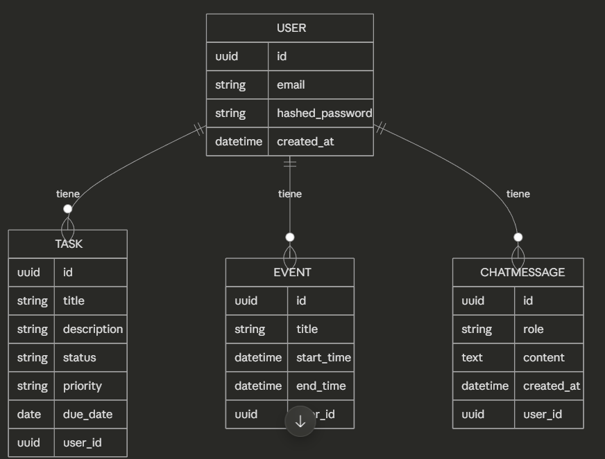

Instrucciones de instalación y arranque en el [README de la raíz](../README.md). Esta página documenta el modelo de datos y los endpoints.

## Modelo de datos

### User
| Campo | Tipo | Descripción |
|---|---|---|
| id | UUID | Identificador único |
| email | string | Email del usuario, único |
| hashed_password | string | Contraseña cifrada (bcrypt vía passlib) |
| created_at | datetime | Fecha de registro |

### Task
| Campo | Tipo | Descripción |
|---|---|---|
| id | UUID | Identificador único |
| title | string | Título de la tarea |
| description | string (opcional) | Detalle adicional |
| status | enum | pending / in_progress / done |
| priority | enum | low / medium / high |
| due_date | date (opcional) | Fecha límite |
| user_id | FK → User | Propietario de la tarea |
| created_at | datetime | Fecha de creación |

### Event
| Campo | Tipo | Descripción |
|---|---|---|
| id | UUID | Identificador único |
| title | string | Título del evento |
| description | string (opcional) | Detalle adicional |
| start_time | datetime | Inicio |
| end_time | datetime | Fin (debe ser posterior a `start_time`) |
| user_id | FK → User | Propietario del evento |
| created_at | datetime | Fecha de creación |

### Conversation
| Campo | Tipo | Descripción |
|---|---|---|
| id | UUID | Identificador único |
| title | string (opcional) | Título de la conversación |
| user_id | FK → User | Propietario de la conversación |
| created_at | datetime | Fecha de creación |

### ChatMessage
| Campo | Tipo | Descripción |
|---|---|---|
| id | UUID | Identificador único |
| conversation_id | FK → Conversation | Conversación a la que pertenece |
| role | enum | user / assistant |
| content | text | Contenido del mensaje |
| created_at | datetime | Fecha del mensaje |

> `ChatMessage` no tiene `user_id` propio: el dueño se hereda a través de `conversation_id → Conversation.user_id`, porque un mensaje solo tiene sentido dentro de la conversación de un usuario concreto. Todavía no hay forma de crear mensajes vía la API (eso llega con la integración de IA) — por ahora `Conversation`/`ChatMessage` solo tienen CRUD de gestión.

### Relaciones
- Un **User** tiene muchas **Task** (1:N)
- Un **User** tiene muchos **Event** (1:N)
- Un **User** tiene muchas **Conversation** (1:N)
- Una **Conversation** tiene muchos **ChatMessage** (1:N)

> `Task.user_id`/`Event.user_id` son `nullable=True` a nivel de base de datos por una razón histórica: cuando se añadió la FK ya existían filas de antes de tener auth. En vez de borrarlas se dejaron huérfanas (invisibles vía la API, nunca aparecen en los filtros por usuario). Todo lo creado a través de la API siempre lleva `user_id`.
>
> Esquema sujeto a cambios según avance el desarrollo (ej. futura entidad `Goal` para agrupar tareas por objetivo).



## Endpoints

Todos los endpoints bajo `/tasks`, `/events` y `/conversations` requieren autenticación (`Authorization: Bearer <access_token>`) y solo devuelven/afectan datos del usuario autenticado — intentar acceder a un recurso de otro usuario da `404`, igual que si no existiera.

### Auth
| Método y ruta | Descripción |
|---|---|
| `POST /auth/register` | Crea un usuario. Body JSON `{email, password}`. `400` si el email ya existe. |
| `POST /auth/login` | Credenciales como form-data (`username` = email, `password`). Devuelve `{access_token, refresh_token, token_type}`. `401` si son incorrectas. |
| `POST /auth/refresh` | Body JSON `{refresh_token}`. Devuelve un par de tokens nuevo. `401` si el refresh token no es válido, expiró, o es en realidad un access token. |

El access token dura 30 minutos; el refresh, 7 días. No hay revocación de tokens (logout) todavía.

### Task
| Método y ruta | Descripción |
|---|---|
| `POST /tasks` | Crea una tarea. |
| `GET /tasks` | Lista las tareas del usuario. Filtros opcionales `?status=` y `?priority=`. |
| `GET /tasks/{id}` | Una tarea concreta. `404` si no existe o no es tuya. |
| `PUT /tasks/{id}` | Actualización parcial: solo se cambian los campos enviados. |
| `DELETE /tasks/{id}` | Borra la tarea. `204` si se borró, `404` si no existía. |

### Event
| Método y ruta | Descripción |
|---|---|
| `POST /events` | Crea un evento. `422` si `end_time` no es posterior a `start_time`. |
| `GET /events` | Lista los eventos del usuario, ordenados por `start_time`. |
| `GET /events/{id}` | Un evento concreto. `404` si no existe o no es tuyo. |
| `PUT /events/{id}` | Actualización parcial; si el resultado deja `end_time <= start_time`, `422`. |
| `DELETE /events/{id}` | Borra el evento. `204` si se borró, `404` si no existía. |

### Conversation
| Método y ruta | Descripción |
|---|---|
| `POST /conversations` | Crea una conversación vacía. Body JSON `{title}` opcional. |
| `GET /conversations` | Lista las conversaciones del usuario, más reciente primero. |
| `GET /conversations/{id}` | La conversación con todos sus mensajes (`messages: []` si no tiene ninguno). `404` si no existe o no es tuya. |
| `DELETE /conversations/{id}` | Borra la conversación y sus mensajes (cascada). `204` si se borró, `404` si no existía. |

Todavía no hay un endpoint para enviar mensajes (`POST /conversations/{id}/messages` o similar) ni integración con ningún LLM — eso es el siguiente paso (Bloque 4.3 en adelante).

Para probar la API de forma interactiva: `http://localhost:8000/docs` (el botón "Authorize" acepta las credenciales de `/auth/login` directamente).

## Tests

```bash
pytest
```

Los tests usan una base de datos de Postgres aparte (`db_test` en el [docker-compose.yml](../docker-compose.yml) de la raíz, puerto `5434`), nunca la de desarrollo. `tests/conftest.py` lee `TEST_DATABASE_URL` del `.env` y le aplica las migraciones de Alembic automáticamente antes del primer test, así que solo hace falta tener el contenedor `db_test` levantado (`docker-compose up -d` desde la raíz ya lo incluye).

Cada test que necesita un usuario/tarea/evento lo crea vía la propia API y lo borra en el teardown de su fixture (ver `tests/conftest.py`) — no hay rollback de transacción por test. El coste real de la suite es el hashing de contraseñas con bcrypt, no las queries a la base de datos, así que no compensa la complejidad de un esquema transaccional por ahora.
